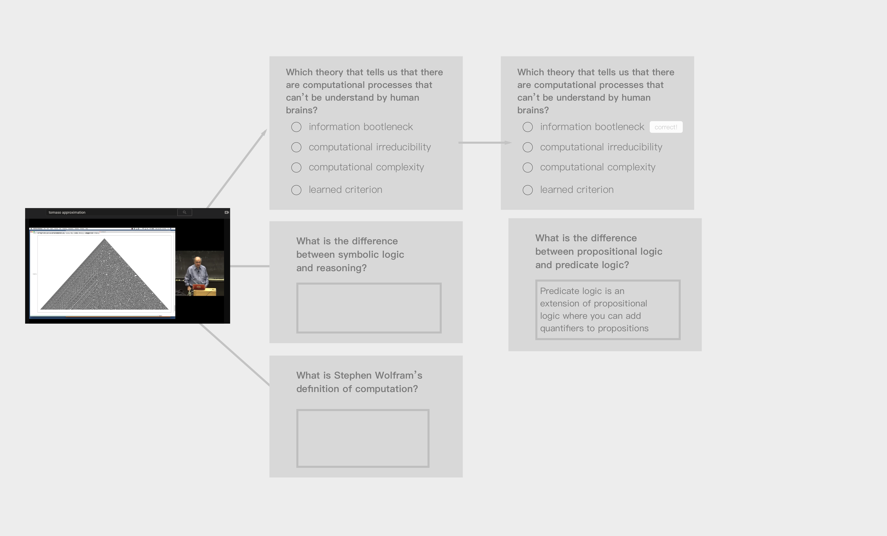

# Introduction 

Let's start with a future view of an individual's education. Many of us have used the internet to educate ourselves with the abundance of medium to high quality videos, papers, articles, podcasts and how-tos being uploaded from numerous individuals, groups, and institutions like never before (60 hours of video are uploaded to youtube.com every minute). 

Let us imagine that all of what you have learned online, throughout the entirety of your life, from the hundreds of Youtube videos, Wikipedia articles, Nature papers, and podcasts you've read, watched, or listened to, were all added structurally to your **knowledge journey**, and what if that journey could be consolidated into what we might call a **knowledge footprint** that could be shared with others? Could this replace static degrees? Or augment them to be more inclusive of a learner's true knowledge?

Our current approach to education is to treat knowledge acquisition like a chapter in the individual's life that mostly happen in a few places. This is misleading since we accrue knowledge from everywhere and most recently the internet has become a primary source of acquisition but has gone mostly unaccounted for. Watching a whole series of Youtube lectures on the Neurobiology of Depression or Discrete Mathematics goes mostly unnoticed when someone views one's resume or by simply looking at their degree.

The ideas behind this *knowledge ecosystem*, presents only one of many possible answers to bringing our education system into modernity. The goal of it would be to promote the long held idea of the life-long learner. Moving away from the education chapter of an individual's life to the individual as an evolving learner, learning the necessary skills for what life presents them with today. It would also (combined with traditional education) begin to show us a more accurate depiction of a learner's knowledge and theorefore that of their society's collective knowledge. 
 
 
 Visualised over time, we would see a learner's so called **knowledge journey**. This could also serve as a way for others who may be on similar **knowledge journey** or those who were looking for a change to find inspiration or be apart of a cohort. You would be able to correlate someone's life work or occupation to their **knowledge journey** and eventually begin to find and cluster similar  journeys that could emerge through unsupervised learning leading to whole new subjects or journeys that others could follow.
 
In this essay, I will propose a knowledge ecosystem, a new way of approaching education that tries to take in a more accurate depiction of a learner's true knowledge. It will require significant effort to bring to life but I believe the benefits will outweigh the costs. I will talk about how we can use machine learning, deep learning in particular, to help create and support our knowledge cosystem which is made up of a **digital knowledge footprint**, **knowledge journeys**, and a collective *human knowledge graph*. We will also introduce current advances in deep learning and a novel neural network that would allow us to take the space of unstructured educational content and begin to map it unto the human knowledge graph, and how we can use generative models to test a learner\'s knowledge of recently viewed educationcal content through questions and answers, no what matter the subject. I will name a few benefits of such a future.

- A society where learners do not simply compete for a degree but where they can feel safe to create their own unique journey through human knowledge whilst being recognised and predictable to others
- A society where a learner's knowledge is derived not from what we know about a degree but by their actual knowledge which is alive and therefore always evolving
- A society that better understands itself, through the understanding of the many journey's it's members have taken

I will also show that this imagined future is not only **desirable** for society but a required future for an individual to match the pace at which we are advancing. Let us not forget, that even software engineering is being recreated with machine learning as a key pillar which has happened seemingly overnight.
It is tantamount that we have adaptative systems that can represent our knowledge and make us predictable even as we hasten the pace at which the indiivdual learns, the future pushes us to know more than we've ever known and to be able to learn quicker than we once did

This hypothetical future isn't just conceptual, most of what I will present t you today is currently feasible due to the most recent advances in machine learning, and in particular deep learning, which will enable us to begin designing such a future today. 

I will end this essay with a call to action.

<small>*For the purpose of this essay we will talk mostly about digital knowledge acquisition and leave the reader to extend the basics to knowledge obtained elsewhere.</small>

# Primary Concerns

 There are 3 popular concerns that I will attempt to address in this article about online learning in the present and near future. I will attempt to address them here and in the implementation section.
 
 The first concern we have is
 
- **Passive Consumption** - most of online content is viewed passively by the learner and the result of passive consumption is that learner's do not grasp the concepts or master the content being taught.
- **Untested Knowledge** - even if the learner was engaged while viewing a piece of educational content their knowledge is untested and therefore it isn't clear if they've mastered the content accurately and in some sense holistically. 
- **Knowledge Representation** - even if the learner was engaged and their knowledge was tested, simply knowing the counts or types of video they watched doesn't make their knowledge predictable and useful to others. In fact, most people are unaware of all the content they've consumed over the years and cannot synthesise it as well as they possible could.
 
## Knowledge Ecosystem Example

Let us put forward an example the matches each of these concerns. But in order to do so we need to lay out the our eco
In order to address the concerns above we have put together the basic components of this knowledge system. We have also mentioned that we will focus on the *digital* aspects as we believe it presents the biggest leap forward for knowledge representation. 

An ecosystem

## Passive Consumption and Untested Knowledge

> How would such an ecosystem insure us against passive consumption?

As you can see, I've bundled passive consumption and untested knowledge because our proposed system approaches both of these by always testing knowledge.

Given a piece of educational content, our knowledge system will generate a set of questions and answers that theoretically capture the major concepts and facts that the learner should know after viewing a part or the content in whole. 

You can imagine watching a Youtube video and after a learner views 15 minutes of an hour long lecture on computational complexity a quiz is presented (a set of questions and answers conditioned on the past 15 minutes of video,) and the results are recorded.  In the future we would also be able to use the knowledge graph 

The knowledge system would only consider content that has been watched with some engagement or if they can test out of the content. 

## The Problem of Knowledge Representation

# Concepts 

## Digital Knowledge Footprint
The concept of a digital education footprint is is a custom symbol and profile that represents one's education relative to that of others. Each symbol should be somewhat unique and the profile could capture the general education as well as the intricacies. 

A symbol which represents somethng as complex as one's education will likely not be enough for employeers and co-workers to understand the . A symbol must show that one is in a particular "class" while also  Symbols generally have to make trade-offs

## Knowledge Journeys

Image src: https://www.researchgate.net/figure/t-SNE-projection-of-the-embedding-of-all-learners-in-the-dataset-Major-labels-are_fig1_323391033
 between the complexity of what it represents and it's ability to convey , the legi from dealing with the task of reduction of info. So we introduce **Journeys** which show how someone has traversed the uy
If most people had their digital education footprint, they would be 

## Collective Human Knowledge Graph

The knowledge graph will be the backbone of a learners journey through human knowledge. As a learner continues to consume educational content, their fingerprint as wethe learner watches new content they extend their knowledge graph either stre current links 

We have so far introduced **knowledge footprint** and **knowledge journeys**, which claim to be the right elements to synthesise one's education while capturing the complexity on one hand and making the learner relatable and predictable on the other hand. But how does one create a path? From video to video? From topic/subject to topic/subject? If so, how might a machine decide on the correct topic(s)? We have had plenty of advances in topic models but perhaps what we actually need to combine topic models with a graph of human knowledge. This graph, like Google or Wolfram's knowledge graph, should be generated both from the current structure of education and also driven by the unsupervised learning of new topics/subjects that do not currently exist within our current structure. 

This graph would be useful so content on the web could be easily mapped to the graph adn relate one user to another as well as create trails.

## Deep Learning Applications in Learning and Feedback
### Summary
### EC2QA Network - a novel network for educational content to questions and answers
The last piece we'll introduce here is a novel artificial neural network that would allow us to take any unstructured educat 

# Towards an ecoystem of teaching machines

So how would a universal teaching machine eclipse these challenges? We will present a solution that meets all three criteria by introudcing a theoretical artificial network architecture to cover the first two.

neural then cover each concept in detail. Our idea of a digital education footprint,  journeys, and a knowledge graph will provide us with what we need to take a first stab at encompassing a learner's whole education by addressing the three concerns.

In order to take all of our videos 

## The components
A component of a universal teaching machine should be able to take any of the billions of educational content online (and eventualyl off) and by using machine learning and deep learning techniques complete the following:
- assign it to a one or more knowledge subjects (i.e. math, design, computer science)
- generate a set of adequate questions and answers that test the learner's (what is x? a, b, c, or d) knowledge throughout the learning session

 
Over time, it is plausible, that our digital education footprint would be the most important representation of a learners level of education. Even more important than our primary education; it has done much to make us predictable, but it has sacrificed the true range of a learner's gained knowledge and wisdom coming from any other place than the institution is willing to give credit for. 

Since we've largely rely upon large institutions to educate groups of learners, many have grown deeply familiar with having a perfectly demarcated path towards a degree, so it has been much harder for learners to use this abundance of knowledge to chart their own educational journey in today's fast moving world.

 being   us how to the peer pressure of cohorts, self-learning  learned Imagine that if you signed up for a job, your primary consideration and also your digital education could be conveyed as a path through the web that others attempt to follow or mix and match. Now let us imagine a world where our digital education fingerprint allowed us to

  
# Theories for statistical learning theory and deep learning

Theory of the learnable
Mutual Information (IT)
Joint probability

